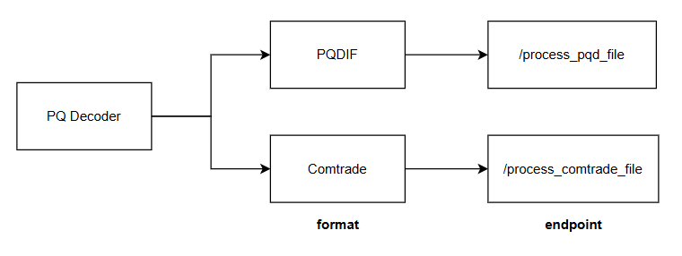

## svc_pq_decoder
PQ Decoder is a specialized software tool for parsing and analyzing Power Quality Data (PQD) and COMTRADE files. It supports both event-based (transients, dips, swells) and trend-based (long-term harmonics, voltage fluctuations) data decoding, enabling detailed power system diagnostics.This project draws inspiration and references from two key sources: gemstone/pqdif (a C# library for PQD parsing) and miguelmoreto/pycomtrade (a Python COMTRADE parser). Special thanks to the creators of these repositories.

## Prerequisite
- Java development environment
  - Install any Java-supported IDE (e.g., IntelliJ IDEA, VS Code with Java extensions).
  - java version 20++
    
## Installation guide
- download IDE 
  - Install any IDE that support java development(e.g. IntelliJ IDEA, vscode)
- pull the latest pq_decoder
- run the backend
  - open the IDE
  - Set the active profile to dev (development mode). 
  - start service
- invoke the endpoint
  - option 1 - Postman
  - option 2 - Frontend

## Endpoints
- /process_pqd_file
- /process_comtrade_file

## References
- pqdif
  - https://github.com/gemstone/pqdif
- comtrade
  - https://github.com/miguelmoreto/pycomtrade/ 

